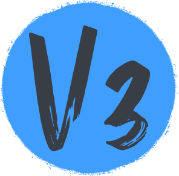
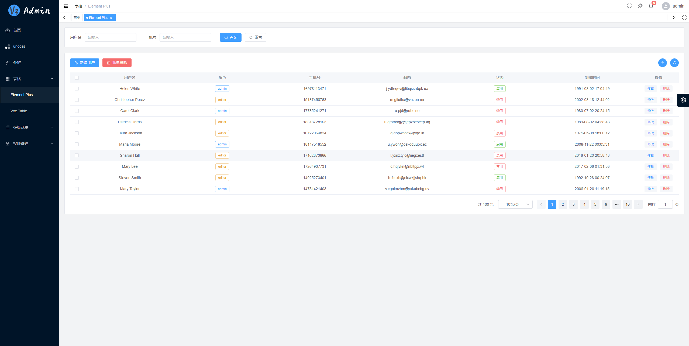

<div align="center">
  
  <h1>V3 Admin Vite</h1>
  <span>English | <a href="./README.zh-CN.md">中文</a></span>
</div>

## ⚡ Introduction

V3 Admin Vite is a free and open source middle and background management system basic solution, based on mainstream framework such as Vue3, TypeScript, Element Plus, Pinia and Vite

- Vue Cli 5.x: [v3-admin](https://github.com/un-pany/v3-admin)
- Electron desktop: [v3-electron-vite](https://github.com/un-pany/v3-electron-vite)

China repository: [Gitee](https://gitee.com/un-pany/v3-admin-vite)

## 📚 Document

- Chinese documentation: [link](https://juejin.cn/post/7089377403717287972)
- Chinese getting started tutorial: [link](https://juejin.cn/column/7207659644487139387)

## 📺 Online preview

| Location     | account             | Link                                            |
| ------------ | ------------------- | ----------------------------------------------- |
| github-pages | `admin` or `editor` | [link](https://un-pany.github.io/v3-admin-vite) |

## ❤️ Generate electricity with love

- **Completely free**：But hopefully you order a star !!!
- **Very concise**：No complicated encapsulation, no complicated type gymnastics, out of the box
- **Detailed annotations**：Each configuration item is written with as detailed comments as possible
- **Latest dependencies**: Regularly update all third-party dependencies to the latest version
- **Very specification**: The code style is unified, the naming style is unified, and the comment style is unified

## Feature

- **Vue3**：The latest Vue3 composition API using Vue3 + script setup
- **Element Plus**：Vue3 version of Element UI
- **Pinia**: An alternative to Vuex in Vue3
- **Vite**：Really fast
- **Vue Router**：router
- **TypeScript**：JavaScript With Syntax For Types
- **PNPM**：Faster, disk space saving package management tool
- **Scss**：Consistent with Element Plus
- **CSS variable**：Mainly controls the layout and color of the item
- **ESlint**：Code verification
- **Prettier**： Code formatting
- **Axios**: Promise based HTTP client (encapsulated)
- **UnoCSS**: Real-time atomized CSS engine with high performance and flexibility
- **Mobile Compatible**: The layout is compatible with mobile page resolution

## Functions

- **User management**: Log in and out of the demo
- **Authority management**: Page-level permissions (dynamic routing), button-level permissions (directive permissions, permission functions), and route navigation guards
- **Multiple Environments**: Development, Staging, Production
- **Multiple themes**: Normal, Dark, Dark Blue, three theme modes
- **Multiple layouts**：Left, Top, Left Top, three layout modes
- **Error page**: 403, 404
- **Dashboard**: Display different Dashboard pages according to different users
- **Other functions**：SVG, Dynamic Sidebar, Dynamic Breadcrumb Navigation, Tabbed Navigation, Screenfull, Adaptive Shrink Sidebar, Hook (Composables)

## 🚀 Development

```bash
# configure
1. installation of the recommended plugins in the .vscode directory
2. node version 18.x or 20+
3. pnpm version 8.x or latest

# clone
git clone https://github.com/un-pany/v3-admin-vite.git

# enter the project directory
cd v3-admin-vite

# install dependencies
pnpm i

# start the service
pnpm dev
```

## ✔️ Preview

```bash
# stage environment
pnpm preview:stage

# prod environment
pnpm preview:prod
```

## 📦️ Multi-environment packaging

```bash
# build the stage environment
pnpm build:stage

# build the prod environment
pnpm build:prod
```

## 🔧 Code inspection

```bash
# code formatting
pnpm lint

# unit test
pnpm test
```

## Git commit specification reference

- `feat` add new functions
- `fix` Fix issues/bugs
- `perf` Optimize performance
- `style` Change the code style without affecting the running result
- `refactor` Re-factor code
- `revert` Undo changes
- `test` Test related, does not involve changes to business code
- `docs` Documentation and Annotation
- `chore` Updating dependencies/modifying scaffolding configuration, etc.
- `workflow` Work flow Improvements
- `ci` CICD
- `types` Type definition
- `wip` In development

## Project preview




## 💕 Contributors

Thanks to all the contributors!

<a href="https://github.com/un-pany/v3-admin-vite/graphs/contributors">
  
</a>

## 💕 Thanks star

Small projects are not easy to get a star, if you like this project, welcome to support a star! This is the only motivation for the author to maintain it on an ongoing basis (whisper: it's free after all)

## ☕ Donate

[See how to donate](https://github.com/un-pany/v3-admin-vite/issues/69)

## Group

QQ group：1014374415 (left) && add me on WeChat，Invite you to join WeChat group (right)


## 📄 License

[MIT](./LICENSE)

Copyright (c) 2022-present [pany](https://github.com/pany-ang)


1、使用常见的对象存储（LakeFS、Ceph、MinIO等）搭建一个具有一定容错能力的对象存储数据服务。
2、了解并运用以上对象存储系统提供的API，进行文件的基本操作（上传、下载、删除、归档等）。
3、能够读取用户上传的JPEG或RAW格式照片的元数据。
4、自由选择合适的框架，构建基于Web或用户端应用，该应用应实现的功能：
a、用户管理：不同的用户只能管理和查看自己上传的照片；
b、照片管理：用户可以在自己的空间内创建（删除、修改）子目录，对照片进行上传、下载、删除、查看照片(包含元数据)；
c、照片分类：用户可以根据元数据（拍摄日期范围、镜头或相机型号、光圈值、快门速度等）筛选照片；